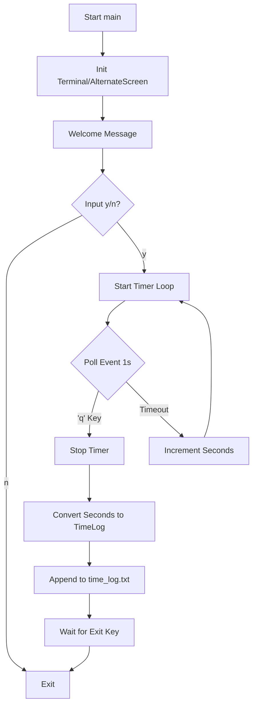

# Architecture & Program Flow

This document outlines the high-level architecture and execution flow of the `rust_study_timer` application.

## High-Level Overview

The application is a CLI-based study timer that:
1.  Initializes a dedicated terminal interface.
2.  Prompts the user to start a session.
3.  Runs a timer loop that counts execution time.
4.  Upon completion, saves the session data to a local log file.

## Program Flow

### 1. Initialization (`src/main.rs`)
-   The program starts in `main()`.
-   **Terminal Setup**: It initializes `crossterm` to enter the "Alternate Screen", sets the title to "Study Timer", and positions the cursor.
-   **Dependencies**: Uses `crossterm` for terminal manipulation and input handling.

### 2. User Prompt (`src/util/io.rs`)
-   `util::io::welcome_message()` displays the ASCII header.
-   `util::io::handle_yes_no()` puts the terminal into **raw mode** to capture single keystrokes without "Enter".
    -   It waits for 'y' (Start) or 'n' (Exit).
    -   If 'n', it cleans up and exits.
    -   If 'y', it invokes the callback function: `util::timer::timer`.

### 3. The Timer Loop (`src/util/timer.rs`)
-   The `timer()` function enters a loop.
-   **Event Polling**: It uses `crossterm::event::poll` with a **1-second timeout**.
    -   This timeout effectively acts as the timer tick (1 second).
-   **Input Handling**: Inside the poll, it checks for the 'q' key to quit the timer.
-   **State**: It maintains an `elapsed_seconds` counter, incremented every loop iteration.

### 4. Session Completion & Storage (`src/util/secs_to_time_log.rs`, `src/util/io.rs`)
-   When the loop breaks (user pressed 'q'):
    -   `util::secs_to_time_log::secs_to_time_log(elapsed_seconds)` is called.
    -   It converts raw seconds into a `TimeLog` struct (Hours, Minutes, Seconds) and generates a random ID.
-   `util::io::update_time_log(&TimeLog)` is called.
    -   It locates (or creates) `time_log.txt` in the executable's parent directory.
    -   It serializes the `TimeLog` struct to JSON.
    -   It appends the JSON line to the file.

### 5. Termination
-   The program waits for a final keypress from the user.
-   It disables raw mode and leaves the Alternate Screen, restoring the user's terminal to its previous state.

## Data Flow Diagram

